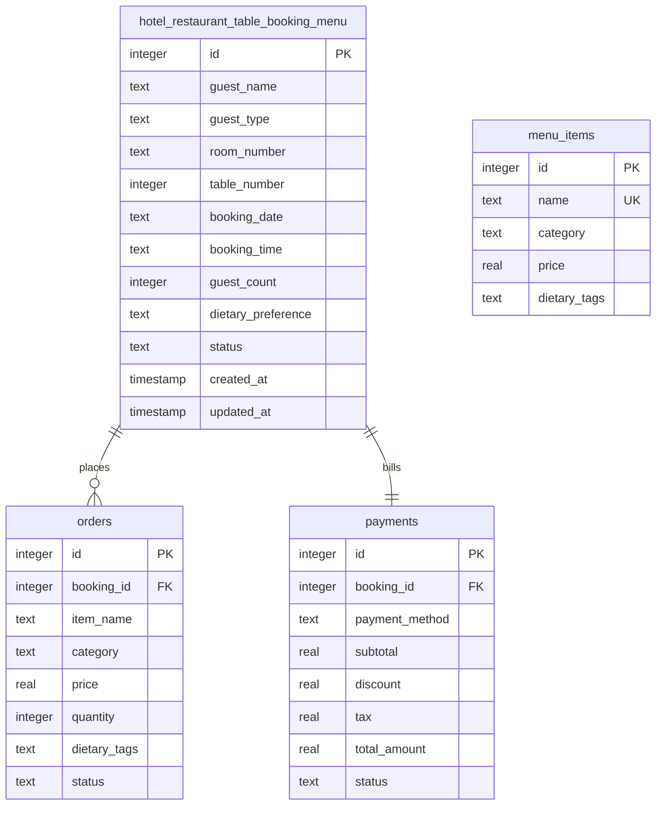

# Database Design & Schema Specifications

The system utilizes an SQLite database (`sasi_hotel.db`) containing 4 core tables to manage restaurant bookings, orders, menu catalogs, and payments.

---

## 1. Entity Relationship Schema

---

## 2. Table Schemas

### Table 1: `hotel_restaurant_table_booking_menu`
Represents customer reservations.
- `id` (INTEGER, PK, AUTOINCREMENT)
- `guest_name` (TEXT, NOT NULL)
- `guest_type` (TEXT, CHECK('Hotel Guest', 'Walk-in'), NOT NULL)
- `room_number` (TEXT, NULL for Walk-in, NOT NULL for Hotel Guests validated at API level)
- `table_number` (INTEGER, NOT NULL)
- `booking_date` (TEXT, YYYY-MM-DD, NOT NULL)
- `booking_time` (TEXT, HH:MM, NOT NULL)
- `guest_count` (INTEGER, NOT NULL)
- `dietary_preference` (TEXT, CHECK('None', 'Vegetarian', 'Vegan', 'Gluten-Free', 'Nut-Allergy'), DEFAULT 'None')
- `status` (TEXT, CHECK('Active', 'Completed', 'Cancelled', 'Archived'), DEFAULT 'Active')

### Table 2: `menu_items`
Static reference menu catalog for Aura Cafe.
- `id` (INTEGER, PK, AUTOINCREMENT)
- `name` (TEXT, NOT NULL, UNIQUE)
- `category` (TEXT, NOT NULL) - Appetizer, Main Course, Dessert, Beverage
- `price` (REAL, NOT NULL)
- `dietary_tags` (TEXT, NOT NULL) - Comma-separated list of preferences it is safe for.

### Table 3: `orders`
Food order items associated with a table reservation.
- `id` (INTEGER, PK, AUTOINCREMENT)
- `booking_id` (INTEGER, FK references `hotel_restaurant_table_booking_menu.id` ON DELETE CASCADE)
- `item_name` (TEXT, NOT NULL)
- `category` (TEXT, NOT NULL)
- `price` (REAL, NOT NULL)
- `quantity` (INTEGER, NOT NULL)
- `dietary_tags` (TEXT, NOT NULL)
- `status` (TEXT, CHECK('Pending', 'Served', 'Cancelled'), DEFAULT 'Pending')

### Table 4: `payments`
Billing integration details.
- `id` (INTEGER, PK, AUTOINCREMENT)
- `booking_id` (INTEGER, FK references `hotel_restaurant_table_booking_menu.id` ON DELETE CASCADE)
- `payment_method` (TEXT, CHECK('Card', 'Cash', 'Room Charge', 'Unpaid'), DEFAULT 'Unpaid')
- `subtotal` (REAL, DEFAULT 0.0)
- `discount` (REAL, DEFAULT 0.0) - 10% on subtotal for Hotel Guests
- `tax` (REAL, DEFAULT 0.0) - 18% GST on (subtotal - discount)
- `total_amount` (REAL, DEFAULT 0.0)
- `status` (TEXT, CHECK('Unpaid', 'Paid', 'Refunded'), DEFAULT 'Unpaid')
